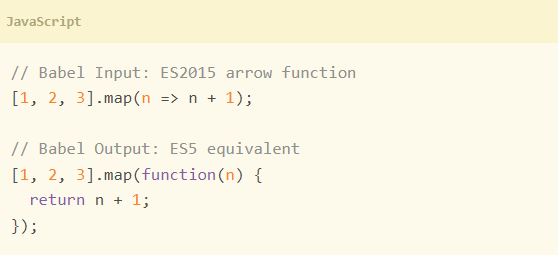
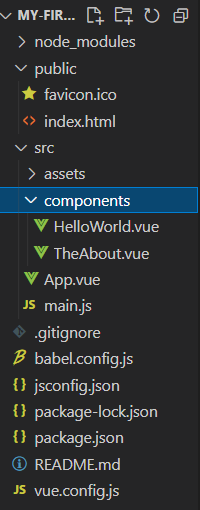

## Vue CLI

- Vue.js 개발을 위한 표준 도구
- 프로젝트 구성을 도와주는 역할을 하며 Vue 개발 생태계에서 표준 tool 기준을 목표로 함
- 확장 플러그인, GUI, Babel 등 다양한 tool 제공

### Node.js

- 자바스크립트를 브라우저가 아닌 환경에서도 구동할 수 있도록 하는 자바스크립트 런타임 환경
  - 브라우저 밖을 벗어 날 수 없던 자바스크립트 언어의 태생적 한계를 해결
- Chrome V8 엔진을 제공하여 여러 OS 환경에서 실행할 수 있는 환경을 제공
- 즉, 단순히 브라우저만 조작할 수 있던 자바스크립트를 SSR 아키텍처에서도 사용할 수 있도록 함
- 2009년 Ryan Dahl에 의해 발표

### NPM (Node Package Manage)

- 자바스크립트 언어를 위한 패키지 관리자
  - Python에 Pip가 있다면 Node.js에는 NPM
  - pip와 마찬가지로 다양한 의존성 패키지를 관리
- Node.js의 기본 패키지 관리자
- Node.js 설치 시 같이 설치됨


### Vue CLI Quick start

- 설치

```
$ npm install -g @vue/cli
```

- 버전 확인

```
$ vue --version
```

- 프로젝트 생성

```
$ vue create my-first-app
```

- npm 레지스트리 변경 (환경에 따라 나오지 않을 수 있음)

- Vue 2버전 선택

```
Vue CLI v5.0.4
? Please pick a preset : (Use arrow keys)
> Default ([Vue 3] babel, eslint)
  Default ([Vue 2] babel, eslint)
```

- 프로젝트 디렉토리 이동

```
$ cd my-first-app
```

- 서버 실행

```
$ npm run serve
```

## Babel & Webpack

### Babel

- JavaScript compiler
- 자바스크립트의 ECMAScript 2015+ 코드를 이전 버전으로 번역/변환해 주는 도구
- 과거 자바스크립트의 파편화와 표준화의 영향으로 코드의 스펙트럼이 매우 다양
  - 이 때문에 최신 문법을 사용해도 이전 브라우저 혹은 환경에서 동작하지 않는 상황이 발생
- 원시 코드(최신 버전)을 목적 코드(구 버전)로 옮기는 번역기가 등장하면서 개발자는 더 이상 내 코드가 특정 브라우저에서 동작하지 않는 상황에 대해 크게 고민하지 않을 수 있게 됨 



### Webpack

- "static module bundler"
- 모듈간의 의존성 문제를 해결하기 위한 도구
- 프로젝트에 필요한 모든 모듈을 매핑하고 내부적으로 종속성 그래프를 빌드함 

### Static Module Bundler

- 모듈은 단지 파일 하나를 의미 (ex. js 파일 하나 === 모듈 하나)
- 모듈 의존성 문제를 해결해주는 작업을 Bundling이라 함
- 이러한 일을 해주는 도구가 Bundler이고, Webpack은 다양한 Bundler 중 하나
- 여러 모듈을 하나로 묶어주고 묶인 파일은 하나(혹은 여러 개)로 합쳐짐
- Bundling된 결과물은 더 이상 순서에 영향을 받지 않고 동작하게 됨
- snowpack, parcel, rollup.js 등의 webpack 이외에도 다양한 모듈 번들러 존재

#### 배경

- 브라우저만 조작할 수 있었던 시기의 자바스크립트는 모듈 관련 문법 없이 사용 됨 
- 하지만 JS와 애플리케이션이 복잡해지고 크기가 커지자 전역 scope를 공유하는 형태의 기존 개발 방식의 한계점이 드러남
- 그래서 라이브러를 만들어 필요한 모듈을 언제든지 불러오거나 코드를 모듈 단위로 작성한느 등의 다양한 시도가 이루어짐

#### 여러 모듈 시스템

- **ESM(ECMA Script Module)**
- AMD(Asynchronous Module Definition)
- CommonJS
- UMD(Universal Module Definition)

#### Module 의존성 문제

- 모듈의 수가 많아지고 라이블러리 혹은 모듈 간의 의존성(연결성)이 깊어지면서 특정한 곳에서 발생한 문제가 어떤 모듈 간의 문제인지 파악하기 어려움
- 즉, Webpack은 이 모듈 간의 의존성 문제를 해결하기 위해 등장

### Vue 프로젝트 구조



- Node_modules
  - node.js 환경의 여러 의존성 모듈
- public/index.html
  - Vue 앱의 뼈대가 되는 파일
  - 실제 제공되는 단일 html 파일
- src/assets
  - webpack에 의해 빌드 된 정적 파일
- src/components
  - 하위 컴포넌트들이 위치
- src/App.vue
  - 최상위 컴포넌트

- src/main.js
  - webpack이 빌드를 시작할 때 가장 먼저 불러오는 entry point
  - 실제 단일 파일에서 DOM과 data를 연결했던 것과 동일한 작업이 이루어지는 곳
  - Vue 전역에서 활용할 모듈을 등록할 수 있는 파일 
- babel.config.js
  - babel 관련 설정이 작성된 파일
- package.json
  - 프로젝트의 종속성 목록과 지원되는 브라우저에 대한 구성 옵션이 포함 
- package-lock.json
  - node_modules에 설치되는 모듈과 관련된 모든 의존성을 설정 및 관리
  - 팀원 및 배포 환경에서 정확히 동일한 종속성을 설치하도록 보장하는 표현
  - 사용 할 패키지의 버전을 고정
  - 개발 과정 간의 의존성 패키지 충돌 방지 

### 정리

#### Node.js

- JavaScript Runtime Environment
- JavaScript를 브라우저 밖에서 실행할 수 있는 새로운 환경

#### Bable

- Compiler
- ES2015+ JavaScript 코드를 구 버전의 JavaScript로 바꿔주는 도구

#### Webpack

- Module Bundler
- 모듈 간의 의존성 문제를 해결하기 위한 도구

