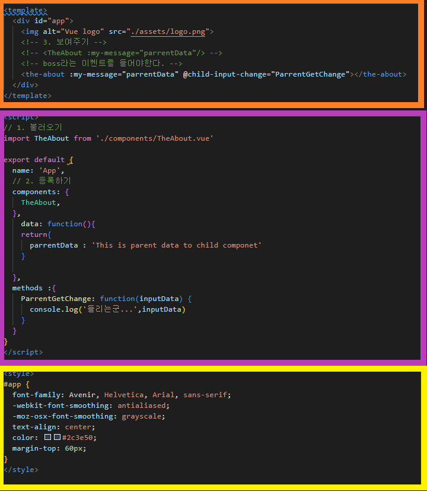

## Pass Props & Emit Events

### 컴포넌트 작성

- Vue app은 자연스롭게 중첩된 컴포넌트 트리로 구성됨
- 컴포넌트간 부모-자식 관계가 구성되며 이들 사이에 필연적으로 의사소통이 필요함
- 부모는 자식에게 데이터를 전달(Pass Props)하며, 자식은 자신에게 일어난 일을 부모에게 알림(Emit event)
  - 부모와 자식이 명확하게 정의된 인터페이스를 통해 격리된 상태를 유지할 수 있음
- "Props는 아래로, event는 위로"

- 부모는 props를 통해 자식에게 '데이터'를 전달하고, 자식은 events를 통해 부모에게 '메시지'를 보냄 

### 컴포넌트 구조



#### 템플릿(HTML)

- HTML의 body 부분
- 각 컴포넌트를 작성 

#### 스크립트(JavaScript)

- JavaScript가 작성되는 곳
- 컴포넌트 정보, 데이터, 메서드 등 vue 인스턴스를 구성하는 대부분이 작성됨

#### 스타일(CSS)

- CSS가 작성되며 컴포넌트의 스타일을 담당 

### 컴포넌트 등록 3단계

1. 불러오기(import)
2. 등록하기(register)
3. 보여주기(print)


### Pass Props & Emit Events


### Props

- props는 부모(상위) 컴포넌트의 정보를 전달하기 위한 사용자 지정 특성
- 자식(하위) 컴포넌트는 props 옵션을 사용하여 수신하는 props를 명시적으로 선언해야 함
- 즉, 데이터는 props 옵션을 사용하여 자식 컴포넌트로 전달됨
- 주의
  - 모든 컴포넌트 인스턴스에는 자체 격리된 범위가 있음
  - 즉, 자식 컴포넌트의 템플릿에서 상위 데이터를 직접 참조할 수 없음 

#### Static Props 작성

- 자식 컴포넌트(About.vue)에 보낼 prop 데이터 선언
- 작성법
  - prop-data-name="value"

```vue
//App.vue
<template>
  <div id="app">
    
    <about my-message="This is prop data"</about>
  </div>
</template>
```

- 수신할 prop 데이터를 명시적으로 선언 후 사용

```vue
// About.vue
<template>
	<div>
        <h1>About</h1>
        <h2>{{myMessage}}</h2>
    </div>
</template>

<script>
export default{
    name:"About",
    props:{
        myMessage: String,
    }
}
</script>
```

#### Dynamic Props 작성

- v-bind directive를 사용해 부모의 데이터의 props를 동적으로 바인딩
- 부모에서 데이터가 업데이트 될 때마다 자식 데이터로도 전달됨

```vue
<template>
  <div id="app">
    
    <the-about
               my_message="This is prop data"
               :parent-data="parrentData"
               >
    </the-about>
  </div>
</template>
<script>
// 1. 불러오기
import TheAbout from './components/TheAbout.vue'

export default {
  name: 'App',
  // 2. 등록하기
  components: {
    TheAbout,
  },
    data: function(){
    return{
      parrentData : 'This is parent data by v-bind'
    }

  },

}
</script>

```

- 마찬가지로 수신할 prop 데이터를 명시적으로 선언 후 사용

```vue
<template>
<div>
  <h1>{{myMessage}}</h1>
  <h2>{{parentdata}} </h2>
</div>
</template>

<script>
export default {
  name : 'TheAbout',
  props:{
    myMessage:String,
      parentData :String
  },


}
</script>
```

#### Props 이름 컨벤션

- during declaration (선언 시)
  - camelCase
- in template(HTML)
  - kebab-case

#### 컴포넌트의 'data'는 반드시 함수여야 함

- 기본적으로 각 인스턴스는 모두 같은 data 객체를 공유하므로 새로운 data 객체를 반환(return)하여야 함

```javascript
data : function() {
    return {
        myData: null,
    }
}
```

#### Props시 자주하는 실수

- Static 구문을 사용하여 숫자를 전달하려고 시도하는 것
- 실제 JavaScript 숫자를 전달하려면 값이 JavaScript 표현식으로 평가되도록 v-bind를 사용해야함

```vue
<!-- 이것은 일반 문자열 "1"을 전달합니다. -->
<comp some-prop="1"></comp>

<!-- 이것은 실제 숫자로 전달합니다. -->
<comp :some-prop="1"></comp>
```


### 단방향 데이터 흐름

- 모든 Props는 하위 속성과 상위 속성 사이의 단방향 바인딩을 형성
- 부모의 속성이 변경되면 자식 속성에게 전달되지만, 반대 방향으로 안 됨 
  - 자식 요소가 의도치 않게 부모 요소의 상태를 변경하여 앱의 데이터 흐름을 이해하기 어렵게 만드는 일을 방지
- 부모 컴포넌트가 업데이트될 때마다 자식 요소의 모든 prop들이 최신 값으로 업데이트 됨 

### Emit event

- "Listening to Child Components Events"
- $emit(eventName)
  - 현재 인스턴스에서 이벤트를 트리거
  - 추가 인자는 리스너의 콜백 함수로 전달
- 부모 컴포넌트는 자식 컴포넌트가 사용되는 템플릿에서 v-on을 사용하여 자식 컴포넌트가 보낸 이벤트를 청취(v-on을 이용한 사용자 지정 이벤트 )


#### Emit event 작성

- 현재 인스턴스에서 $emit 인스턴스 메서드를 사용해 child-input-change 이벤트를 트리거

```vue
<template>
<div>
  <h1>{{myMessage}}</h1>
  <h2>{{parentData}}</h2>
  <input type="text"
  v-model="childInputData"
  @keyup.enter="childInputChange"
  >
</div>
</template>

<script>
export default {
  name : 'TheAbout',
  props:{
    myMessage:String,
    parrentData :String,
  },
  data: function(){
    return{
    childInputData:''
    }
  },
  methods :{
    childInputChange: function() {
      console.log('야!!',this.childInputData)
      // 부모 컴포넌트에게 1번인자라는 이름의 이벤트를 발생 + 2번 인자 데이터를 보냄 
      this.$emit('child-input-change',this.childInputData)
    }
  },
}
</script>

<style>

</style>
```

- 부모 컴포넌트(App.vue)는 자식 컴포넌트(About.vue)가 사용되는 템플릿에서 v-on directive를 사용하여 자식 컴포넌트가 보낸 이벤트(child-input-change)를 청취 

### event 이름 컨벤션

- 컴포넌트 및 props와는 달리, 이벤트는 자동 대소문자 변환을 제공하지 않음
- HTML의 대소문자 구분을 위해 DOM 템플릿의 v-on 이벤트 리스너는 항상 자동으로 소문자 변환되기 때문에 v-on:myEvent는 자동으로 v-on:myevent로 변환
- 이러한 이유로 이벤트 이름에는 항상 kebab-case를 사용하는 것을 권장

```vue
this.$emit('myEvnet')
<!-- 이벤트가 동작하지 않음 -->
<my-component @my-event="doSomething"></my-component>
```

