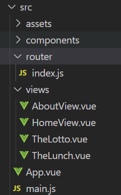

## Vue Router

- "Vue.js 공식 라우터"

- 라우트(route)에 컴포넌트를 매핑한 후, 어떤 주소를 렌더링할 지 알려줌

- SPA 상에서 라이퉁을 쉽게 개발할 수 있는 기능을 제공

- router

  - 위치에 대한 최적의 경로를 지정하며, 이 경로를 따라 데이터를 다음 장치로 전향시키는 장치

  

### Vue Router 시작하기

1. 프로젝트 생성 및 이동

```
$ vue create my-router-app
$ cd my-router-app
```

2. Vue Router plugin 설치 (Vue CLI 환경)

```
$vue add router
```

- 기존 프로젝틀르 진행하고 있던 도중에 추가하게 되면 App.vue를 덮어쓰므로, 프로젝트 내에서 다음 명령을 실행하기 전에 필요한 경우 파일을 백업(커밋)해야 함 

3. Commit 여부 - Y
4. History mode 사용 여부 - Y 

### Vue Router로 인한 변화

1. App.vue 코드

```vue
<template>
  <div id="app">
    <nav>
      <!-- <router-link to="/">Home</router-link> | -->
      <!-- namedroute
      <router-link :to="{name:'home'}">Home</router-link> |
      <router-link :to="{name:'about'}">About</router-link> | -->
      <router-link :to="{name:'lotto', params: {lottoNum:6}}">Lotto</router-link> |
      <router-link to="/lunch">Lunch</router-link>
    </nav>
    <router-view/>
  </div>
</template>
```

2. router/index.js 생성

3. views 디렉토리 생성



### Vue Router - "index.js

- 라우트에 관련된 정보 및 설정이 작성 되는 곳 

```javascript
import Vue from 'vue'
import VueRouter from 'vue-router'
import HomeView from '../views/HomeView.vue'
Vue.use(VueRouter)

const routes = [
  {
    path: '/',
    name: 'home',
    component: HomeView
  },
  {
    path: '/about',
    name: 'about',
    // route level code-splitting
    // this generates a separate chunk (about.[hash].js) for this route
    // which is lazy-loaded when the route is visited.
    component: () => import(/* webpackChunkName: "about" */ '../views/AboutView.vue')
  },
]
```

### Vue Router - "router-link"

- \<router-link>
  - 사용자 네비게이션을 가능하게 하는 컴포넌트
  - 목표 경로는 'to' prop으로 지정됨
  - HTML5 히스토리 모드에서 router-link는 클릭 이벤트를 차단하여 브라우저가 페이지를 다시 로드하지 않도록 함 
  - a 태그지만 우리가 알고 있는 GET 요청을 보내는 a 태그와 조금 다르게, 기본 GET 요청을 보내는 이벤트를 제거하는 형태로 구성됨

```vue
<router-link to="/">Home</router-link>
```

### Vue Router - "router-view"

- <router -view>
  - 주어진 라우트에 대해 일치하는 컴포넌트를 렌더링하는 컴포넌트
  - 실제 component가 DOM에 부착되어 보이는 자리를 의미
  - router-link를 클릭하면 해당 경로와 연결되어 있는 index.js에 정의한 컴포넌트가 위치

### History mode

- HTML History API를 사용해서 router를 구현한 것
- 브라우저는 히스토리는 남기지만 실제 페이지는 이동하지 않는 기능을 지원
- 즉, 페이지를 다시 로드하지 않고 URL을 탐색할 수 있음
  - SPA의 단점 중 하나인 "URL이 변경되지 않는다."를 해결

### History API

- DOM의 Windwo 객체는 history 객체를 통해 브라우저의 세션 기록에 접근할 수 있는 방법을 제공
- history 객체는 사용자를 자신의 방문 기록 앞과 뒤로 보내거나, 기록의 특정 지점으로 이동하는 등 유용한 메서드와 속성을 가짐 


### 1. Named Routes

- 이름을 가지는 라우트
- 명명된 경로로 이동하려면 객체를 vue-router 컴포넌트 요소의 prop에 전달

```javascript
//index.js
const routes = [
  {
    path: '/',
    name: 'home',
    component: HomeView
  },
  {
    path: '/about',
    name: 'about',
    component: () => import(/* webpackChunkName: "about" */ '../views/AboutView.vue')
  },
```

```vue
//app.vue
<template>
  <div id="app">
    <nav>
      <router-link :to="{name:'home'}">Home</router-link> |
      <router-link :to="{name:'about'}">About</router-link> 
    </nav>
    <router-view/>
  </div>
```


### 2. 프로그래밍 방식 네비게이션

- \<router-link>를 사용하면 선언적 탐색을 위한 a 태그를 만드는 것 외에도, router의 인스턴스 메서들르 사용하여 프로그래밍 방식으로 같은 작업을 수행할 수 있음

| 선언적 방식             | 프로그래밍 방식   |
| ----------------------- | ----------------- |
| \<router-link to="..."> | $router.push(...) |

- Vue 인스턴스 내부에서 라우터 인스턴스에 $router로 접근할 수 있음
- 따라서 다른 URL로 이동하려면 this.$router.push를 호출 할 수 있음
  - 이 메서드는 새로운 항목을 히스토리 스택에 넣기 때문에 사용자가 브라우저의 뒤로가기 버튼을 클릭하면 이전 URL로 이동하게 됨
- \<router-link>를 클릭할 때 내부적으로 호출되는 메서드이므로 \<router-link :to="...">를 클릭하면, router.push(...)를 호출하는 것과 같음 

- 작성할 수 있는 인자 예시

```javascript
// literal string path
router.push('home')

// object
router.push({path:'home'})
//named route
router.push({ name: 'user', params:{userId : '123'}})
// with query, resulting in /register?plan=private
router.push({path: 'register', query:{plan:'private'}})

```

- About에서 Home으로 이동하는 로직

```vue
<template>
  <div class="about">
    <h1>This is an about page</h1>
    <button @clikc="moveToHome">
        Home으로 이동
    </button>
  </div>
</template>

<script>
  export default {
      name : 'AboutView',
      methods : {
          moveToHome :fucntion() {
          //this.$router.push('/')
          this.$router.push({name:'home'})
      },
    },
  }
</script>
```

### 3. Dynamic Route Matching

- 동적 인자 전달
- 주어진 패턴을 가진 라우트를 동일한 컴포넌트에 매핑해야 하는 경우
- 예를 들어 모든 User에 대해 동일한 레이아웃을 가지지만, 다른 User ID로 렌더링 되어야 하는 User 컴포넌트 예시

```javascript
const routes = [
    {
        path : '/user/:userId',
        name:'User',
        component:User
    }
]
```

- 동작 인자는 :(콜론)으로 시작
- 컴포넌트에서 this.$route.params로 사용 가능

| pattern                            | mathced path          | $route.params                         |
| ---------------------------------- | --------------------- | ------------------------------------- |
| /user/:userName                    | /user/join            | { username: 'john'}                   |
| /user/:userName/article/:articleId | /user/john/article/12 | {username: 'john',<br />articleId:12} |

```javascript
// index.js
const routes = [
  {
    path: '/lotto/:lottoNum',
    name: 'lotto',
    component: () => import(/* webpackChunkName: "about" */ '../views/TheLotto.vue')
  },
]
```

```vue
//TheLotto.vue
<template>
  <div>
    <h1>로또</h1>
    <h2>{{ $route.params.lottoNum }} 개의 번호를 추첨합니다</h2>
    <button @click="someFunc">Get Lucky Numbers</button>
    <p>{{ selectedLuckyNums }}</p>
  </div>
</template>

<script>
import _ from "lodash"
export default {
  name :'TheLotto',
  data : function() {
    return {
      selectedLuckyNums: [],
    }
  },
  methods :{
    // 프로그래밍방식네비게이션
    someFunc :function() {
      const numbers = _.range(1,46)
      this.selectedLuckyNums = _.sampleSize(numbers,this.$route.params.lottoNum)
    },

  },
</script>

```

```vue
//App.vue
<template>
  <div id="app">
    <nav>
      <router-link :to="{name:'lotto', params: {lottoNum:6}}">Lotto</router-link> |
    </nav>
    <router-view/>
  </div>
</template>
```


### components와 views

- 기본적으로 작성된 구조에서 components 폴더와 views 폴더 내부에 각기 다른 컴포넌트가 존재하게 됨
- 컴포넌트를 작성해 갈 때 정해진 구조가 있는 것은 아니며, 주로 아래와 같이 구조화하여 활용함

##### App.vue

- 최상위 컴포넌트

##### views/

- router(index.js)에 매핑되는 컴포넌트를 모아두는 폴더
- ex) App 컴포넌트 내부에 AboutView & HomeView 컴포넌트 등록

##### components/

- router에 매핑된 컴포넌트 내부에 작성하는 컴포넌트를 모아두는 폴더
- ex) Home 컴포넌트 내부에 HelloWorld 컴포넌트 등록 


### Vue Router가 필요한 이유

1. SPA 등장 이전
   - 서버가 모든 라우팅을 통제
   - 요청 경로에 맞는 HTML 제공
2. SPA 등장 이후
   - 서버는 index.html 하나만 제공
   - 이후 모든 처리는 HTML 위에서 jS 코드를 활용해 진행
   - 즉, 요청에 대한 처리를 더 이상 서버가 하지 않음 (할 필요가 없어짐)
3. 라우팅 처리 차이
   - SSR 
     - 라우팅에 대한 결정권을 서버가 가짐
   - CSR
     - 클라이언트는 더 이상 서버로 요청을 보내지 않고 응답받은 HTML 문서안에서 주소가 변경되면 특정 주소에 맞는 컴포넌트를 렌더링
     - 라우팅에 대한 결정권을 클라이언트가 가짐
   - 결국 Vue Router는 라우팅의 결정권을 가진 Vue.js에서 라우팅을 편리하게 할 수 있는 tool을 제공해주는 라이브러리 
