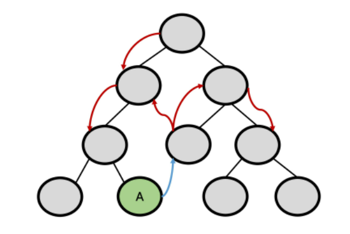
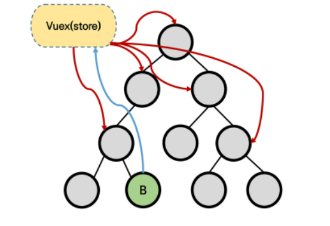

## Vuex Intro

### Vuex

- "Statement managemetn pattern + Library" for vue.js
  - 상태 관리 패턴 + 라이브러리
- 상태(state)를 전역 저장소로 관리할 수 있도록 지원하는 라이브러리
  - 상태가 예측 가능한 방식으로만 변경될 수 있도록 보장하는 규칙 설정
  - 애플리케이션의 모든 컴포넌트에 대한 중앙 집중식 저장소 역할
- Vue의 공식 devtools와 통합되어 기타 고급 기능 제공 

### State

- state는 곧 data이며 해당 어플리케이션에서 핵심이 되는 요소
- 중앙에서 관리하는 모든 상태 정보 

### 상태 관리 패턴

- 컴포넌트의 공유된 상태를 추출하고 이를 전역에서 관리 하도록 함 
- 컴포넌트는 커다란 view가 되면 모든 컴포넌트는 트리에 상관없이 상태에 액세스 하거나 동작을 트리거 할 수 있음
- 상태 관리 및 특정 규칙 적용과 관련된 개념을 정의하고 분리함으로써 코드의 구조와 유지 관리 기능 향상
- 트리거
  - 특정한 동작에 반응해 자동으로 필요한 동작을 실행하는 것

### 기존 Pass props & Emit event

- 각 컴포넌트는 독립적으로 데이터를 관리
- 데이터는 단방향 흐름으로 부모 -> 자식 간의 전달만 가능하며 반대의 경우 이벤트를 트리거
- 장점
  - 데이터의 흐름을 직관적으로 파악 가능
- 단점
  - 컴포넌트 중첩이 깊어지는 경우 동위 관계의 컴포넌트로의 데이터 전달이 불편해짐

- 공통의 상태를 공유하는 여러 컴포넌트가 있는 경우 데이터 전달 구조가 매우 복잡해짐
- 예를 들면, 지나치게 중첩된 컴포넌트를 통과하는 prop

### Vuex management pattern 

- 중앙 저장소(store)에 state를 모아놓고 관리
- 규모가 큰 (컴포넌트 중첩이 깊은) 프로젝트에서 매우 효율적
- 각 컴포넌트에서는 중앙 집중 저장소의 state만 신경 쓰면 됨 
  - 동일한 state를 공유하는 다른 컴포넌트들도 동기화 됨 

### 단방향 데이터 흐름

- state는 앱을 작동하는 원본 소스(data)
- view는 state의 선언적 매핑
- action은 view에 사용자 입력에 대해 반응적으로 state를 바꾸는 방법(methods)

#### 단방향 흐름에 의조한 state 관리

1. 부모 자식 간의 컴포넌트 관계가 단순하거나 depth가 깊지 않은 경우에는 문제가 없음
   - 몇 단계만 거치면 데이터를 쉽게 이동시킬 수 있으며 훨씬 직관적으로 데이터 흐름을 파악할 수 있음
2. 하지만 규모가 커졌을 경우의 상태 관리가 어려워짐
   -  상태를 공유하는 컴포넌트의 상태 동기화 관리가 어려움
   - 상태를 전달할 때 상 -> 하로만 가능
3. A 컴포넌트의 상태를 공유하는 다른 컴포넌트에 pass props & emit event를 통해 동기화 해야 함 

### Vuex를 활용한 state(상태) 관리

1. 상태의 변화에 따른 여러 흐름을 모두 관리해야 하는 불편함을 해소할 필요가 있음
   - 상태는 데이터를 주고 받는 컴포넌트 사이의 관계도 충분히 고려해야 하기 때문에 상태 흐름 관리가 매우 중요해짐
2. 결국 이러한 상태를 '올바르게 관리하는 저장소'의 필요성을 느끼게 됨
   - 상태를 한 곳(store)에 모두 모아놓고 관리하자
   - 상태의 변화는 모든 컴포넌트에서 공유
   - 상태의 변화는 오로지 Vuex가 관리하여 해당 상태를 공유하고 있는 모든 컴포넌트는 변화에 '반응'
3. A 컴포넌트와 같은 상태를 공유하는 다른 컴포넌트는 신경쓰지 않고, 오로지 상태의 변화를 Vuex에 알림

