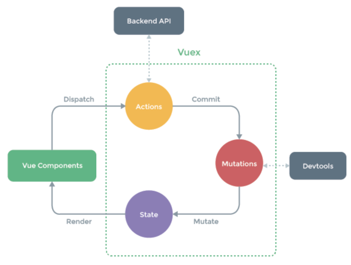

## Vuex Core Concepts

### Vuex 핵심 컨셉

#### State

- 중앙에서 관리하는 모든 상태 정보
  - Vuex는 single state tree를 사용
  - 즉, 이 단일 객체는 모든 애플리케이션 상태를 포함하는 "원본 소스(single source of truth)"의 역할을 함
  - 이는 각 애플리케이션마다 하나의 저장소만 갖게 된다는 것을 의미함
- 여러 컴포넌트 내부에 있는 특정 state를 중앙에서 관리하게 됨
  - 이전의 방식은 state를 찾기 위해 각 컴포넌트를 직접 확인해야 했음 
  - Vuex를 활용하는 방식은 Vuex Store에서 각 컴포넌트에서 사용하는 state를 한 눈에 파악 가능 
- State가 변화하면 해당 state를 공유하는 여러 컴포넌트의 DOM은 (알아서) 렌더링
- 각 컴포넌트는 이제 Vuex Store에서 state 정보를 가져와 사용

#### Mutations

- 실제로 state를 변경하는 유일한 방법
- mutation의 handler(핸들러 함수)는 반드시 동기적이어야 함 
  - 비동기적 로직(ex. 콜백함수)은 state가 변화하는 시점이 의도한 것과 달라질 수 있으며, 콜백이 실제로 홏루될 시기를 알 수 있는 방법이 없음(추적 할 수 없음)
- 첫번째 인자로 항상 state를 받음
- Actions에서 commit() 메서드에서 의해 호출됨

#### Actions

- Mutations와 유사하지만 다음과 같은 차이점이 있음
  1. state를 변경하는 대신 mutations를 commit() 메서드로 호출해서 실행
  2. mutations와 달리 비동기 작업이 포함될 수 있음(Backend API와 통신하여 Data Fetching 등의 작업 수행)
- context 객체 인자를 받음
  - context 객체를 통해 store/index.js 파일 내에 있는 모든 요소의 속성 접근 & 메서드 호출이 가능
  - 단, state를 직접 변경하지 않음
- 컴포넌트에서 dispatch() 메서드에 의해 호출됨 
- "Actions를 통해 state를 조작할 수 있지만, state는 오로지 Mutations를 통해서만 조작 해야함"
  - 명확한 역할 분담을 통해 서비스 규모가 커져도 state를 올바르게 관리하기 위함 ##

#### Getters

- state를 변경하지 않고 활용하여 계산을 수행(computed 속성과 유사)
  - compute를 사용하는 것처럼 getters는 저장소의 상태(state)를 기준으로 계산
  - 예를 들어, state에 todoList라는 해야 할 일의 목록의 경우 완료된 todo 목록만을 필터링해서 출력해야 하는 경우가 있음 
- computed 속성과 마찬가지로 getters의 결과는 state 종속성에 따라 캐시(cached)되고, 종속성이 변경된 경우에만 다시 재계산 됨
- getters 자체가 state를 변경하지는 않음
  - state를 특정한 조건에 따라 구분(계산)만 함 
  - 즉, 계산된 값을 가져옴 

### 정리

- state
  - 중앙에서 관리하는 모든 상태 정보(data)
  - Mutations에 의해 변경됨
- Mutations
  - state를 변경하는 유일한 방법
  - 반드시 동기적 로직이어야 함
  - 첫번째 인자로 항상 state를 받고, Actions의 commit()에 의해 호출됨
- Actions
  - Mutations를 commit()으로 호출
  - 비동기 로직 작성 가능
  - 항상 context 객체를 받기 때문에 모든 속성에 접근할 수 있으나 state를 변경해서는 안됨
  - 컴포넌트에서 dispatch() 에 의해 호출됨
- Getters
  - store의 상태를 기반하는 계산 값
  - 실제 상태를 변경하지 않음
  - computed 속성과 유사
