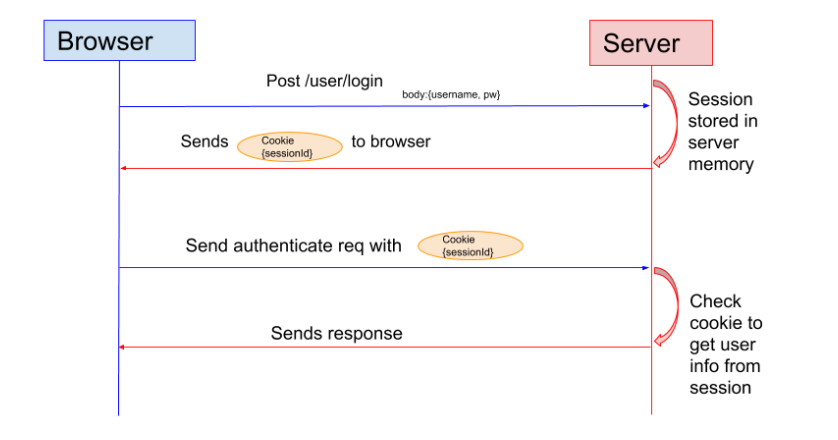
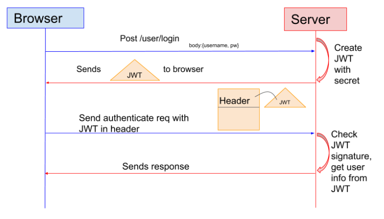

# JWT

https://pronist.dev/143 블로그 내용 정리 

## 개념

- JWT는 유저를 인증하고 식별하기 위한 토큰 기반 인증 시스템
- 토큰은 세션과는 달리 서버가 아닌 **클라이언트**에 저장 되기 때문에 메모리나 스토리지 등을 통해 세션을 관리했던 서버의 부담을 줄일 수 있음 
- JWT가 가지는 핵심적인 특징은, **토큰 자체에 사용자의 권한 정보나 서비스를 사용하기 위한 정보**가 포함 된다는 것
- 데이터가 많이자면 토큰이 커질 수 있으며 토큰이 한 번 발급된 이후 사용자의 정보를 바꾸더라도 토큰을 재발급하지 않는 이상 반영되지 않는다. 


- JWT를 사용하면 RESTful과 같은 무상태(Stateless)인 환경에서 사용자 데이터를 주고 받을 수 있게 된다. **세션(Session)**을 사용하게 될 경우에는 쿠키 등을 통해 식별하고 서버에 세션을 저장했지만 JWT와 같은 토큰을 클라이언트에 저장하고 요청시 단순히 HTTP 헤더에 토큰을 첨부하는 것 만으로도 단순하게 데이터를 요청하고 응답을 받을 수 있다.


### Logic

1. 클라이언트 사용자가 아이디, 패스워드 등을 통해 웹 서비스 인증 
2. 서버에 서명된(Signed) JWT를 생성하여 클라이언트에 응답으로 돌려주기
3. 클라이어늩가 서버에 데이터를 추가적으로 요구할 때 JWT를 HTTP Header에 첨부
4. 서버에서 클라이언트로부터 온 JWT를 검증 


JWT는 JSON 데이터를 Base64 URL-safe Encode 를 통해 인코딩하여 직렬화한 것이 포함되며, 토큰 내부에는 위변조 방지를 위해 개인 키를 통한 **전자서명**도 있다. 따라서 사용자가 JWT를 서버로 전송하면 서버는 서명을 검증하는 과정을 거치게 되며 검증이 완료되면 요청한 응답을 돌려준다.

> Base 64-safe Encode 는 일반적인 Base64 Encode에서 URL에서 오류없이 사용하도록 '+','/'를 각각 '-','_'로 표현한 것이다.


### 구조 

JWT의 구조를 살펴보자. JWT는 Header, Payload, Signature로 구성된다. 또한 각 요소는 .으로 구분된다. Header에는 JWT에서 사용할 **타입과 해시 알고리즘의 종류**가 담겨있으며 Payload는 서버에서 첨부한 사용자 권한 정보와 데이터가 담겨있다. 마지막으로 Signature에는 Header, Payload를 Base64 URL-safe Encode를 한 이후 Header에 명시된 해시함수를 적용하고, 개인키(Private Key)로 서명한 전자서명이 담겨있다. 전자서명 알고리즘으로 타원 곡선 암호화(ECDSA)를 사용한다고 가정하면, 

```
Sig = ECDSA(SHA256(B64(Header).B64(Payload)),PrivateKey)
```

이럴 JWT로 표현하려면, 다음과 같이 되는데, 위에서 만든 전자서명도 Base64 URL-safe Encode로 처리해서 합쳐줄 필요가 있다. 여기서 만든 전자서명은 Header, Payload 변조가 되었는지 확인하기 위해 사용되는 중요 정보이며 JWT를 신뢰할 수 있는 토큰으로 사용할 수 있는 근거가 된다. 

```
JWT = B64(Header).B64(Payload).B64(Sig)
```

전자서명에는 **비대칭 암호화 알고리즘**을 사용하므로 암호화를 위한 키와 복호화를 위한 키가 다르다. 암호화(전자서명)에는 개인키를, 복호화(검증)에는 공개키를 사용한다.

#### Header

- JWT의 메타 정보
- Token 타입을 정의하고(typ), 어떤 signing 알고리즘이 쓰였는지(alg)를 나타냄

```
{
	"typ" : "JWT",
	"alg" : "HS256"
}
```

#### Payload

- 토큰이 만료되는 시간, 유저의 정보와 같은 실질적인 데이터를 담는 영역
- 유저를 특정할 수 있는 값

```
{
	"token_type" : "access", 
	"exp" : 169146719,
	"jti" : "1foo2jwt3id4",
	"user_id" : 123
}
```

#### Signature

- JWT는 signing을 통해 토큰 안에 유저 정보를 담으면서, 안전하게 처리
- Payload 영역에 담긴 유저정보는 인코딩만 되어있을 뿐, 별도의 암호화 처리가 되어 있지 않음
    - 누군가에 의해 쉽게 디코딩 될 수 있고 변조 가능 
- but, payload에는 유저를 특정할 수 있는 user id 만 있기 때문에, 위의 토큰이 디코딩되어, user_id가 노출되는 것은 보안상 큰 문제가 되지 ㅇ낳음 


##### 변조의 문제 해결하기

- Signature가 만들어지기 위해서는 `인코딩된 header`, `인코딩 된 payload` 그리고 `secret`이 필요함 

- Signature는 인코딩 된 header, payload, secret을 합친 뒤 이를 header에 지정한 알고리즘으로 해싱
- header와 payload, secret 값 중 어느 하나라도 일치하지 않으면 signature는 완전히 다른 값을 갖게 됨 


이렇게 생성된 JWT는 클라이언트에 전달 되었다가 이후 요청에 HTTP Header에 담겨서 서버로 전달됨 

서버가 JWT를 검증하는 과정은 JWT가 생성될 때와 마찬가지로 header, payload 그리고 secret을 이용하여 signature를 해싱한 뒤 전달받은 JWT의 signature와 같은지 확인함 

만약 payload가 변조되었다면, 클라이언트에서 받은 signature와 서버가 해싱한 signature가 다를 것 


## Session  vs JWT 

### Session 인증 방식



1. 클라이언트에서 사용자의 인증 정보를 서버에 전달
2. 서버는 인증을 처리한 뒤 해당 user에 대한 session 생성
3. session 정보는 서버에 저장되고, 클라이언트는 session id를 받아 브라우저에 저장
4. 클라이언트는 이후 이루어지는 요청에 session id를 이용합니다.
5. 서버는 전달받은 session id를 이용하여 저장중인 session 정보로 인증처리
6. 만약 session id가 만료되었을 경우에는 1번부타 다시 

- session은 정보를 서버에서 관리함 
- 클라이언트도 브라우저에 session id를 저장하여 사용하지만, session id 자체는 중요한 정보가 담겨있지 않은 일종의 임시 비밀번호이며 실제 session의 정보를 관리하는 것은 전적으로 서버의 역할 
- Django의 경우 기본적으로 제공하는 session 인증을 사용할 경우, `django_session` 테이블이 생성되고 그 안에 `session_key`, `session_data`, `expire_date` 와 같은 필드로 session 정보를 저장 

### JWT 인증 방식 



1. 클라이언트에서 사용자의 인증 정보를 서버에 전달
2. 서버는 인증 정보로 인증을 처리하고, JWT를 생성하여 클라이언트에 전달
3. 클라이언트는 JWT를 브라우저에 저장
4. 클라이언트는 이후 이루어지는 요청에 JWT 이용
5. 서버는 JWT를 검증하여 인증을 처리
6. JWT가 만료되면 토큰을 refresh 

## 구현 


