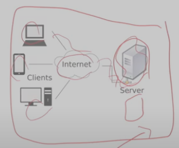

# 메시지 큐

## 좋은 웹 AP가 가져야 할 것들 

### 성능

- 빠른 처리 속도
- 많은 양 처리 

### 안정성

- 고객의 요청에 대한 결과 제공

### 보안

- HTTP 
    - 클라이언트에서 서버로 오는 정보를 들여다 볼 수 있음 
- HTTPS

### 무인 주차 정산 시스템 구현

- 입차시 카메라로 차량번호 인식
- 요금 할인 대상 차량 여부 확인(REST API)
- 출차시 주차 요금 자동 정산

- REST API 평균 응답 시간 4초 
- 해결방법은 비동기 처리

### 응답시간 - 비동기 처리

- Synchronous /Asynchronous는 중요한 개념
- 업무 이해에 기반한 적절한 비동기 처리
- 사용 Language, 프레임워크 환경에서 제공하는 것부터 적용

### 동기 vs 비동기

- 일반적인 코드는 순차적으로 싫애
- 필요에 따라, 특정 명령어들의 모음을 별도의 작업 흐름으로 생성하여 명령 제어권을 바로 이어받을 수 있게 만든 방식이 비동기 처리 방식 

### 비동기 처리로 해결?

- 사용중인 프레임워크에서 제공하는 ㅂ아법
    - Asynchronous support 

