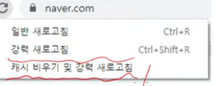
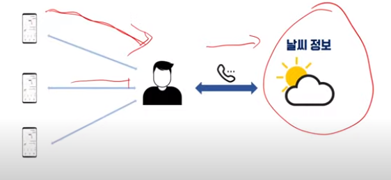
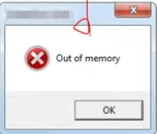

# 캐시

### 캐시 인트로

- 이미지,css, 스크립트 등의 정적 리소스가 대상
- 서버의 리소스 변경(write)이 실시간성으로 클라이언트에 반영되지는 못함
- 얻는게 있으면 잃는게 생기는 법 

### 정의

- 데이터나 값을 복사해 놓는 임시 장소
- 복잡한 수식을 재연산하는 시간을 절약하고 싶은 경우
- 접근 시간이 느린 곳의 데이터를 상대적으로 빠른 장소에 보관
- 캐시 영역에 데이터를 저장해 놓으면 계산, 접근 시간을 대폭 줄일 수 있음

### 고전은 중요하다

- CPU와 메모리를 비교했을 때 HW인 CPU가 상대적으로 빠르다.
- CPU에서 버스를 이용해 메모리(SSD)에 접근하려면, 상대적으로 느리기 때문에 유효한 데이터를 저장하기 위해 CPU 캐시를 사용한다.
- 느린곳에서 빠른 곳으로 옮겨야한다. 

### 응답 지연 값

- 메모리에서 1MB 순차적으로 읽기 -> 250us
- 디스크에서 1MB 순차적으로 읽기 -> 30ms
- 한 패킷의 CA로부터 네덜란드까지의 왕복 지연  -> 150ms

### 온라인 갤러리 구현

- 디스크에 저장된 10개 이미지 파일을 클라이언트가 요청하면 전송해주는 서버 구현 미션
- 이미지 파일의 크기는 1MB 이하
- 파일 변경은 허용하지 않음

- 개발자는 자주 변하는 것과 변하지 않는 것을 구벼할 수 있어야 한다
- 변하지 않는다면 굳이 반복해서 읽어들일 필요가 있을까? 

### 웹 서버 - 이미지 리소스

- 웹 서버는 빈번한 사용이 예상되고 변경이 거의 없을거라 예상되는 이미지 리소스를 http 요청마다 새롭게 읽어 들일까?

#### 생활 캐싱

### 실시간 지하철 형황 서비스 구현

- 특정 지하철역의 0호선의 실시간 열차 현황 정보를 제공
- 정보의 출처는 '서울 열린 데이터 광장 Open API'
- 출퇴근 시간 기준 각 역마다 대략 100건/초의 요청을 가정 

#### 구현 방법

- 역 기준의 대략적인 지하철 도착 현황 정보만으로 고객의 니즈는 충족
- 10초 간격으로 WAS 내에 지하철 정보를 임시 저장(캐싱)하도록 구현 

### 캐싱에 적합한 대상은?

- **Read가 빈번하고 Write는 거의 없는 경우** 

- **메모리는 매우 중요한 자원, 신중, 선별적 캐싱 정책이 중요**

### 캐싱 == 메모리 I/O

- 정말 이것만큼은 피할 수 있도록 조심 또 조심 

### TTL

- 보통 캐싱된 데이터에는 만료시간 및 갱신 주기가 존재함
- 데이터 sync.는 너무나도 중요

### 캐싱 적용기

- 메뉴 목록을 하드 코딩하지는 않았을 듯
- 메뉴 데이터는 DB에 존재한다고 가정
- 사용자 요청이 많아질수록 DB 조회 많아짐 

#### 직접 구현

- 메모리에 특정 객체를 생성한 후 캐싱하고자 하는 데이터를 저장
- 단 해당 프로세스에서 유일한 저장 장소가 되도록 잘 선언해서 사용(싱글톤 패턴)
- List menuList = new ArrayList();
- menuList = selectMenuListFromDB();

### 로컬 캐시 - Ehcache

- 로컬 캐시 라이브러리
- WAS n대 클러스터링 되어 있다면 동기화 이슈 발생
- WAS 간 내부 통신을 통해 동기화 작업 선행
- Encache가 지원하는 RMI 활용한 클러스터링 설정

### Redis

- NoSQL & Cache 솔루션, 메모리 기반으로 구성
- in-memory DB
- 데이터베이스로 사용될 수 있으며 Cache로도 사용될 수 있는 기술 

## 결론

### 캐싱 실전 적용

- Cache의 기본적인 개념 파악 및 캐싱에 적합한 데이터 선택
- 웹 AP 코드에 상대적으로 느린 I/O(DB 연동) 데이터를 직접 특정 객체에 저장
- 로컬 캐시 적용해보기
- In-memory DB 솔루션 Redis 경험해보기 