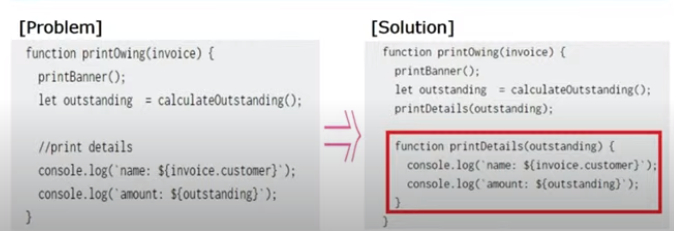
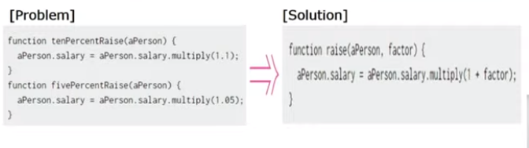
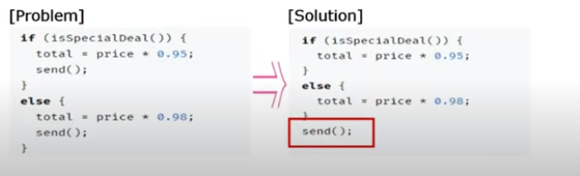
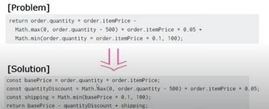
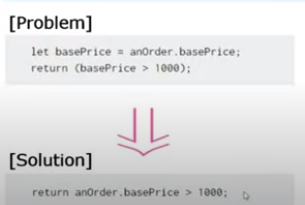
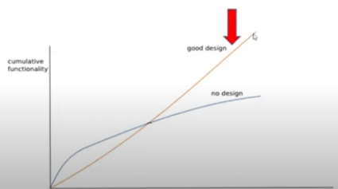

[toc]

# 코드 리팩토링

## 개념 

### 코드 리팩토링이란?

- 소프트웨어의 겉보기 동작은 그대로 유지한채
- 코드를 깨끗하고 이해하기 쉽게 구조만 변경하는 것 
- 핵심은 "이 코드를 더 좋게 만들 수 있습니까?"에 있음
    - 이에 대한 판단 기준으로는 확장성, 가독성, 유지보수성

### 언제 해야할까?

- 기능 구현이 우선이고, 정상작동되는지 확인한 후에 진행한다.
- 한 번에 하나의 작업에만 집중하고 동시에 진행하지 않는다.
    - 기능 추가 단계 : 기존 코드는 건드리지 말고, 신규 기능 추가에만 집중
    - 리팩토링 단계 : 기능을 추가하지 말 것, 좋은 설계로 코드를 재구성 

### 어떻게 해야 할까?

- 개발 프로세스는 리팩토링할 시점을 결정하는 게 매우 중요하며
- 시점을 정하는 가장 좋은 방법은 범위를 정하는 것 
- 한 번에 한가지 명확하고 구체적인 목표를 갖고 진행하는 것이 중요

## 코드 리팩토링의 유형

- 신규 기능 추가를 대비한 "준비를 위한 리팩토링"
- 높은 가독성을 고려한 "이해를 위한 리팩토링"

### 준비를 위한 리팩토링

- 목적 : 신규 기능을 추가하기 전에, 코드를 쉽게 추가할 수 있도록 대비
- 현재 구조를 살펴보고, 추가되는 코드가 기존 구조에 녹여지기 어렵다면 , 해당 구조를 다듬어서 새로운 기능을 쉽게 적용 가능할 수 있도록 만들어준다. 

#### 예제 1) 파편화된 코드

- 동일한 코드가 반복적으로 작성되어 있다면..
- **별도의 Function**으로 만들고, 이를 호출하는 방식으로 관심사 분리

#### 예제 2) 중복된 유사 로직 

- 의미가 유사한 function이 2개 이상 존재하면 
- **매개변수를 이용**하는 것으로 function을 통합
- 현업에서는 배포 주기를 짧게 가져갈 수 없고, 1주일에 한 번정도만 할 수 있다.  

#### 예제 3) 모든 분기마다 동일 로직

- 조건부 모든 분기에 동일 로직을 구현했다면...

- 분기 밖으로 해당 로직을 이동시켜서, 한 번만 작성한다
- 가독성 있고 위험부담 줄 수 있음.

### 이해를 위한 리팩토링

- 목적 : 코드의 의도를 이해할 수 있또록 가독성을 높인다.
    - 코드를 수정하기 위한 전제조건은 그 코드가 무슨 일을 하는지 파악하는 것
    - 협업하는 동료와 함께 보는 코드는 의도가 명확하게 드러나야 함 .
    - 더 좋은 설계를 위해서는 사소한 것부터 명확하게 만드는 것이 중요

#### 예제 1) 모호한 변수명

- a,b,c의 의도를 알 수 없는 모호한 변수명이라면 

- 변수를 **직관적으로** 선언
- 좋은 프로그래머는 **사람이 이해할 수 있는** 코드를 작성 

#### 예제 2) 길어지는 표현식

- 하나의 표현식이 너무 길어지는 경우에는 ..

- 표현식 또는 해당 부분의 결과를 **의도 파악이 가능한 개별 변수**로 선언 

#### 예제3) 변수가 한 번만 변경

- 변경되는 변수가 하나뿐이라면 ..

- 해당변수가 원래 표현식과 다를 바 없을 때는, 변수 선언 대신 **인라인해서 리턴값으로 처리** 

###  + 비효율적인 때는 ?

- 코드 판독 자체가 불가하여 오히려 시간 낭비인 경우
- 코드가 정상 작동 안한다면, 그냥 새로 짜는게 낫다
- 납기가 임박했을 때는 지양

## 정리

### 성능 개선 vs 리팩토링

- 성능을 높이는 작업도, 리팩토링의 작업 패턴은 유사
- 그러나 성능개선은, 속도를 높기기 위한 목적이고 ..
- 코드 리팩토링은 코드를 깨끗하게 만들기 위함 

### 왜 필요해요 ?

- 코드 리팩토링을 왜 하는가요 ?
- 시간낭비 하는건 아닌가요 ?

 **깨끗하고 좋은 코드를 만들기 위해**

- 설계에 대한 고민없이 작성된 코드는, 초반에는 개발속도가 빠르지만 ...
- 반면, 좋은 설계의 프로그램은 시간이 갈수록 개발 생산성이 높아진다.

 

#### 궁극적 목적

**Economics(경제성) : 적은 인력으로 짧은 시간에 많은 기능을 개발하기 위해 ..**