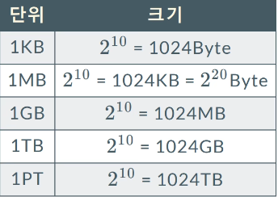
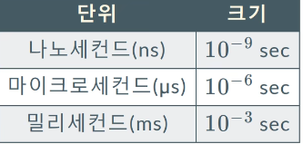
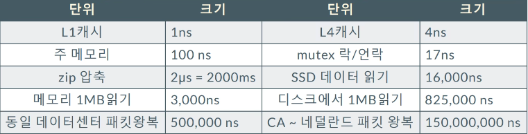

# 계략적 규모 추정

## 각종 단위들

### 데이터 크기 

### 시간 단위

- 밀리 세컨드만 나와도 많이 드는 것 

### 구글 제프 딘 

### 응답 지연에서 알 수 있는 것

- 메모리는 빠르고 디스크는 느리다
- 디스크 탐색은 피한다 <-> 이것이 DB를 쓰는 이유
- 압축 알고리즘은 쓸만하다 -> 데이터 전송시에는 압축할 것 
- 데이터 센터 간의 데이터 교환은 피하라 .

### 가용성 

- 시스템 중단 없이 얼마나 운용될 수 있나
- 보통 99~100% 사이의 값
- SLA(Service Level Agreement)
    - 서비스 사업자가 가용성에 대한 사용자와의 계약 
    - AWS, Azure, GCP 등은 99% 이상의 SLA 제공 

## 트위터의 QPS, 요구량 측정

### 가정 조건

- Daily Active User : 3억
- 50%의 사용자가 매일 사용
- 평균 사용자 1인이 2개의 트윗 작성
- 미디어를 포함한 트윗은 전체의 약 10% 
- 데이터는 5년간 보관
- QPS : Query Per Second

### 추정

- 일간 능동 사용자
    - 3억 x 50% = 1.5억
- QPS
    - 1.5억 & 2트윗 / 24시간 *3600 초 = 3500QPS

- 저장소 요구량
    - 평균 트윗 크기 (가정)
        - 트윗 id : 64byte
        - 트윗 본문 : 140byte
        - 미디어 : 1MB (압축됨)
- 미디어 저장소 요구량
    - 1.5억 x 2트윗 x 10% x 1MB = 30TB/Day
- 5년간 미디어 보관을 위한 저장소
    - 30TB x 365 x 5년 = 약 55 PB

### 설계 면접시 팁

- 중요한 것은 문제를 풀러내는 절차이지 결과가 아님
- 수치는 정확하지 않아도 됨
- 가정, 전제조건은 기록해라
- 단위 주의. 단위는 꼭 붙여야 혼동이 없다.
- QPS, 저장소 요구량 계산등은 몇 번의 연습이 필요 