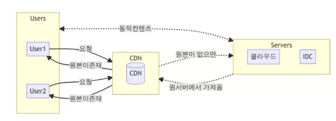
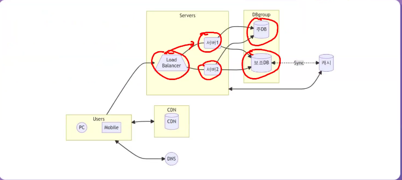
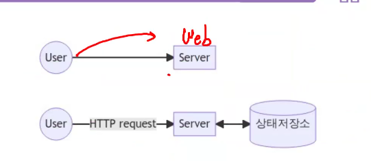
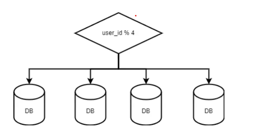
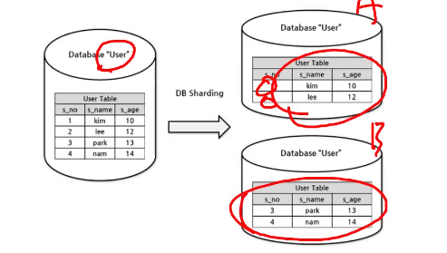

# 사용자 수에 따른 규모 확장성

## 20221017

### DNS 

- 구글을 url에 타이핑하면 일어나는 일은?
- 사용자가 query를 날리고, DNS가 이를 받고 IP로 변환시켜 날려주면 webserver로 간다
- DNS 사용 이유
    - DNS는 URL을 IP로 변경하는 역할을 한다. 

- 왜 DB를 사용할까?
    - DB는 filesystem보다 훨씬 속도가 빠르며, 대량의 정보를 처리할 수 있다.
    - file은 read write에 시간이 더 많이 걸린다.

### RDBMS vs NOSQL

- 아주 낮은 응답 지연시간 요구
- 다루는 데이터가 비정형
    - 정형 데이터는 데이터의 format이 변하지 않음 
    - 컬럼이 있고, value가 있을 때 변하지 않는 것을 정형데이터라고 함
    - 상황에 따라 바뀌는 것을 비정형이라고 함 
- 데이터의 직렬화 <-> 역직렬화만 필요
    - JSON
- 아주 많은 데이터
    - 데이터의 양이 방대함 -> NOSQL 을 사용하는 것이 좋음 
- NOSQL 단점
    - JOIN 등 다양한 데이터 핸들링이 어려움 ! 

### 수직적 확장 vs 수평적 확장

- 수직정 확장 (Scale up) : CPU 증설, RAM 증설
    - CPU, RAM은 한계가 있음
    - 서버가 다운되면 바로 서비스 중단
- 수평적 확장 (Scale out) : 서버 대수를 증가 
    - 최근에는 scale out을 진행 후 load balancing으로 부하를 최소화 함

### DB의 분리 및 로드밸런서 추가 

- 웹 서버의 다중화 
- DB를 read와 write용을 분리 
    - DB는 주로 Write보다는 Read가 많아 발생한다.
    - 주 DB는 주로 Write를 많이 이용하고, 보조 DB의 용량을 더 크게 잡아서, read의 역할만 하게 한다.
    - 이를 통해 DB의 안정성을 가져갈 수 있다. 

### 보조 DB 다중화

- 더 나은 성능
- 안정성 : 데이터 유실 가능성 줄어듦
- 가용성 확보 : 장애 대응 가능 
- 클러스터링 기술이 사용됨 

### 캐시

- '시렁'이라는 뜻의 프랑스어
    - 창고에서 자주 쓰는 것들을 별도에 밖으로 빼내서 선반같은 곳에서 자주 가져다 쓰게 하는 것 
- 읽는 속도가 일반 DB보다 빠름 
    - 최적화가 되어도, DB는 disc고, 캐시는 RAM이기 때문에, 더 빠르다

#### 캐시 고려 사항

- 조회가 많고 갱신이 적은가?
- 데이터의 중요도는?
- 만료 정책은?
    - 캐시는 사이즈가 작기 때문에, 일정 시점에 삭제를 해야한다. 
- DB와 일관성 유지 방법은?
- 장애 발생 대응은?
    - 이중화를 통해 장애 대응
- 캐시 서버의 크기는 얼마나?
    - 다다익선

#### 캐시 방출 정책

- Least Recent Used
    - 가장 최신 데이터를 남겨놓음
- Least Frequently Used
    - 가장 안쓰이는 것들을 보냄
- FIFO
    - 선입선출 

## 20221020

### Contents Delivery N/W (CDN)

- Cloud Front Akamai
- 왜 정적 컨텐츠가 대상인가?
    - 자주 바뀌면 CDN에서 불러오기 적절하지 않을 것이다. 

#### CND 도입시 고려사항

- 비용 : 자주 사용되나?
- 적절한 만료시간 -> 업데이트 주기 설정
- CDN이 죽으면? 장애 대처 방안은? -> 이중화
- 컨텐츠 무효화 방안은 (업체가 제공? 버전 관리?)

#### CDN 반영

### 무상태 계층

- 상태 정보(세션데이터)를 웹 계층에서 제거
- 대신에 이를 DB(NoSQL, Redis 등)에 저장 

### 상태와 무상태

- 왜 별도로 보관할까?
    - 단일서버면 문제 없지만, 이중화된 서버에서 1번 서버에서 작업하다 다운이 된다면 2번 서버로 넘어갈게 모든 세션이 만료된다. 
    - 따라서, 상태저장소에 세션을 저장해서 이를 방지한다. 

### 데이터센터 

- 트래픽 우회
    - 지리적 라우터는 올바른 데이터 센터를 찾아야 함 (GeoDNS 필요)

- 데이터 동기화
    - Fail Over발생시 대책 필요. 데이터 센터 DB를 다중화하는 방법도 있음 (넷플릭스)
- 테스트 배포
    - 여러 위치에서 테스트, 배포 실행 문제. 자동화 필수

### 메시지 큐

- 규모를 더 키우기 위해서는 각기 독립적으로 확장토록 하는게 필요
- 이를 위해 구성 간의 커플링을 느슨하게 할 필요가 있음
- 이를 지원하는 것 중 하나가 메시지 큐(MQ)임.
- Rabbit MQ, Kafka 등이 있음

### 로그, 메트릭, 자동화

- 규모가 커지면 로그, 메트릭(지표)를 수집해야 한다.
- 로그, 메트릭 : 서버별 관리보다는 단일 저장소에 모아서 관리

- 자동화 : CI/CD의 자동화. 로그, 메트릭 컬렉터

### DB 규모 확장

- 수직적 확장 (Scale Up) : 한계가 있음
- 수평적 확장 (Scale Out) : 샤딩
- 샤딩은 디규모 DB를 작은 조각에 분할하여 저장
- 스키마는 같지만, 데이터는중복이 없다
- 클러스터링과는 전혀 다른 기술임 

#### 샤딩 

- 스키마는 동일하지만, 데이터 중복은 없다 

    

- 재 샤딩
    - 기존 샤딩 하나로는 감당이 안될 경우 해야 함
    - 한쪽 공간의 소진이 심할 때 : 샤드 소진(Shadding Exhaust)
    - 샤드 키 변경하고 데이터 재배치해야함
    - Consistant hashing
- 유명인사(Celebrity ) 문제
    - 특정 샤드에 질의가 몰리는 현상
    - 핫스팟 키를 잘 분배해야 한다. 

- Join, 비정규화
    - 이렇게 쪼개면 정규화를 하기 힘듬
    - NoSQL 형태로 가야함

### 정리

- 웹 서버는 무상태로
- 모든 계층에 다중화 도입
- 가능한 많은 데이터를 캐시로
- 각 계층을 독립적 서비스로 분활 (With MQ)
- 여러 데이터 센터 지원
- 정적 컨텐츠는 CDN으로 지원
- 지속적인 모니터링, 자동화 도구 적용
- 데이터 계층을 샤딩을 통해 규모 확장 