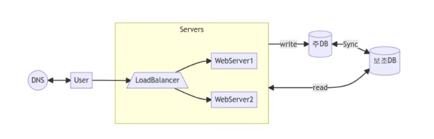
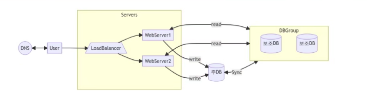
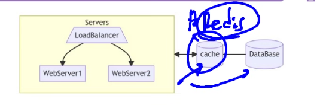

# 사용자 수에 따른 규모 확장성

### DNS 

- 구글을 url에 타이핑하면 일어나는 일은?
- 사용자가 query를 날리고, DNS가 이를 받고 IP로 변환시켜 날려주면 webserver로 간다
- DNS 사용 이유
    - DNS는 URL을 IP로 변경하는 역할을 한다. 

- 왜 DB를 사용할까?
    - DB는 filesystem보다 훨씬 속도가 빠르며, 대량의 정보를 처리할 수 있다.
    - file은 read write에 시간이 더 많이 걸린다.

### RDBMS vs NOSQL

- 아주 낮은 응답 지연시간 요구
- 다루는 데이터가 비정형
    - 정형 데이터는 데이터의 format이 변하지 않음 
    - 컬럼이 있고, value가 있을 때 변하지 않는 것을 정형데이터라고 함
    - 상황에 따라 바뀌는 것을 비정형이라고 함 
- 데이터의 직렬화 <-> 역직렬화만 필요
    - JSON
- 아주 많은 데이터
    - 데이터의 양이 방대함 -> NOSQL 을 사용하는 것이 좋음 
- NOSQL 단점
    - JOIN 등 다양한 데이터 핸들링이 어려움 ! 

### 수직적 확장 vs 수평적 확장

- 수직정 확장 (Scale up) : CPU 증설, RAM 증설
    - CPU, RAM은 한계가 있음
    - 서버가 다운되면 바로 서비스 중단
- 수평적 확장 (Scale out) : 서버 대수를 증가 
    - 최근에는 scale out을 진행 후 load balancing으로 부하를 최소화 함

### DB의 분리 및 로드밸런서 추가 

- 웹 서버의 다중화 
- DB를 read와 write용을 분리 
    - DB는 주로 Write보다는 Read가 많아 발생한다.
    - 주 DB는 주로 Write를 많이 이용하고, 보조 DB의 용량을 더 크게 잡아서, read의 역할만 하게 한다.
    - 이를 통해 DB의 안정성을 가져갈 수 있다. 

### 보조 DB 다중화

- 더 나은 성능
- 안정성 : 데이터 유실 가능성 줄어듦
- 가용성 확보 : 장애 대응 가능 
- 클러스터링 기술이 사용됨 

### 캐시

- '시렁'이라는 뜻의 프랑스어
    - 창고에서 자주 쓰는 것들을 별도에 밖으로 빼내서 선반같은 곳에서 자주 가져다 쓰게 하는 것 
- 읽는 속도가 일반 DB보다 빠름 
    - 최적화가 되어도, DB는 disc고, 캐시는 RAM이기 때문에, 더 빠르다

#### 캐시 고려 사항

- 조회가 많고 갱신이 적은가?
- 데이터의 중요도는?
- 만료 정책은?
    - 캐시는 사이즈가 작기 때문에, 일정 시점에 삭제를 해야한다. 
- DB와 일관성 유지 방법은?
- 장애 발생 대응은?
    - 이중화를 통해 장애 대응
- 캐시 서버의 크기는 얼마나?
    - 다다익선

#### 캐시 방출 정책

- Least Recent Used
    - 가장 최신 데이터를 남겨놓음
- Least Frequently Used
    - 가장 안쓰이는 것들을 보냄
- FIFO
    - 선입선출 