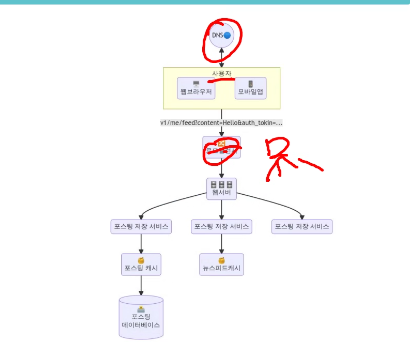

# 시스템 설계 면접

### 무엇을 원하는가?

- 지원자의 설계 능력
- 지원자가 협력에 적합한 사람인지
- 압박의 상황에서도 잘 헤쳐나가는지
- 모르는 문제를 건설적으로 해결할 수 있을지
- 모르는 문제를 건설적으로 해결할 수 있을지
- 어떻게 수천명이 갭라한 것을 한 시간안에 설명할 수 있는가? 완벽한 설계를 요구하진 않음

### 부정적 신호

- 설계의 순수성 집착
    - 비용을 생각하지 않고 진행
    - 트레이드 오프를 못하는 경우
        - 좋은 시스템은 많은 비용을 주면 당연히 만들 수 있다.
        - 하지만, 이를 고려한 설계가 필요하다.
- 완고함, 편협함

- 꼭 MSA를 할 필요는 없다 (이유가 없다면 할 필요가 없는데, 대답하면 안됨)

## 효과적인 멵버의 4단계 접근법

### 1단계 : 문제의 이해 및 범위 설정

- 요구사항을 전부 이해하지 못하고 답을 내면 안됨
- 올바로, 정확히 질문
- 요구샇아을 정확이 이해하는데 필요한 질문

### 2단계 : 개략적인 설계안 제시 및 동의 구하기

- 의견을 자주 구해야 한다
    - 설계에 대한 청사진을 그리고 의견 구하기
    - 화이트포드 등에 핵심 컴포넌트를 포함해 다이어 그램을 그림
    - 최초 설계안이 요구사항을 만족하는지 개략적으로 계산
    - API, 엔트포인트를 제시할 수도 있음
        - 사이즈가 크면 나중에 제시

#### 개략 설계

### 3단계 : 상세적인 설계 단계

- 일단 아래 항목까지는 도달함
    - 전반적으로 달성해야 할 목표 확인
    - 전체 설계의 개략적 청사진
- 이제부터는
    - 면접관과 우선순위를 정함
    - 대부분의 면접관들은 특정 컴포넌트를 깊이있게 설명하기를 원함 . 이에 대한 대응 필요
        - 단축 URL 시스템의 경우 해쉬함수 설계 방법

### 4단계 : 마무리

- 면접관이 후속 질문을 , 또는 추가 논의를 할 수 있다.
    - 면접관이 "시스템 병목, 개선가능한 곳을 찾아라"라고 요구하면 
    - 완벽하다, 개선 부분이 없다 등의 말을 하면 안된다.
        - 설계에 대한 요약을 한번 더 해주면 좋다.
    - 오류가 발생하면 무슨일이 생기는지 따져보면 흥미로울 것이다.
- 운영 이슈를 논의해도 good
- 미래에 닥칠 스케일 아웃 요구에의 대응 방법도 좋다

### 해야할 것 

- 질문을 통해 확인하라. 스스로의 가정이 옳다고 믿지 말아라
- 문제의 요구사항을 이해하라
- 정답이나 최선의 답안은 없다.
- 면접관이 여러분의 사고 흐름을 이해할 수 있게하라
- 가능하면 여러 해법을 함께 제시하라
- 개략적인 부분에 면접관이 동의한다면, 세부사항을 설명하기 시작할 타임이다.
- 가장 중요한 컴포넌트부터 진행하라
- 면접관의 아이디어를 끌어내라
- 포기하지 말라

### 하지 말아야 할 것 

- 전형적인 면접 문제들은 대비
- 요구사항이나 가정들은 분명하지 않은 상태에서 설계 제시 x
- 처음부터 특정 컴포넌트에 대해 너무 깊게 설명 x
- 진행중 막혔다면 힌트 요청
- 소통을 주저하지말라 
- 설계안을 내놓는 순간 면접이 끝난 것이 아니다. 면접관이 끝이라 해야 끝이다.